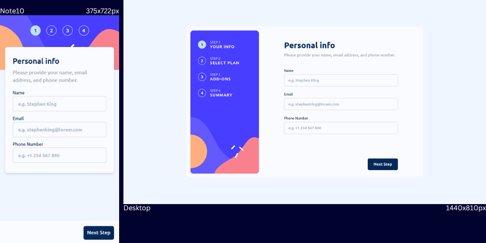
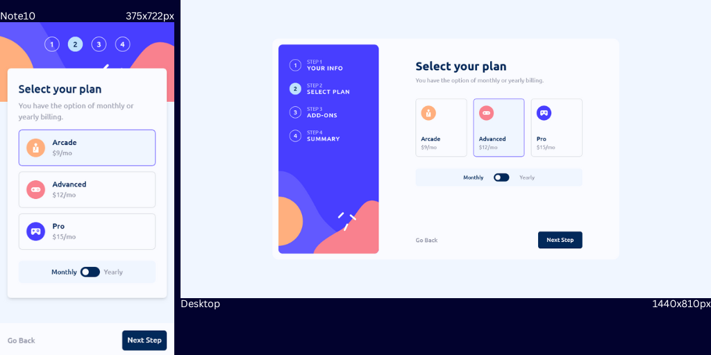
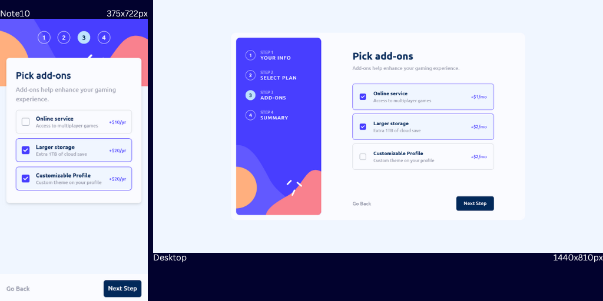
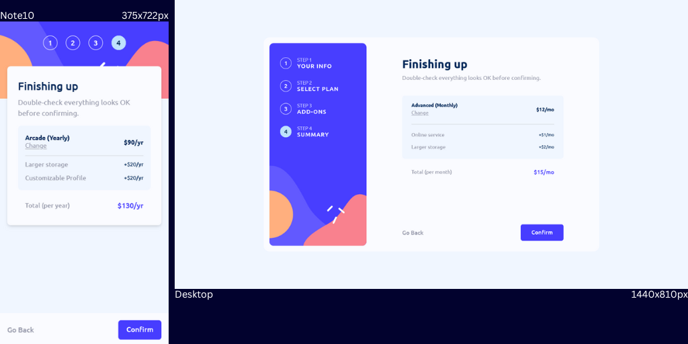
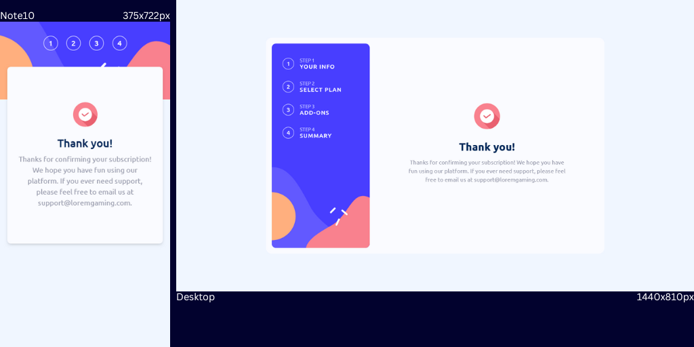
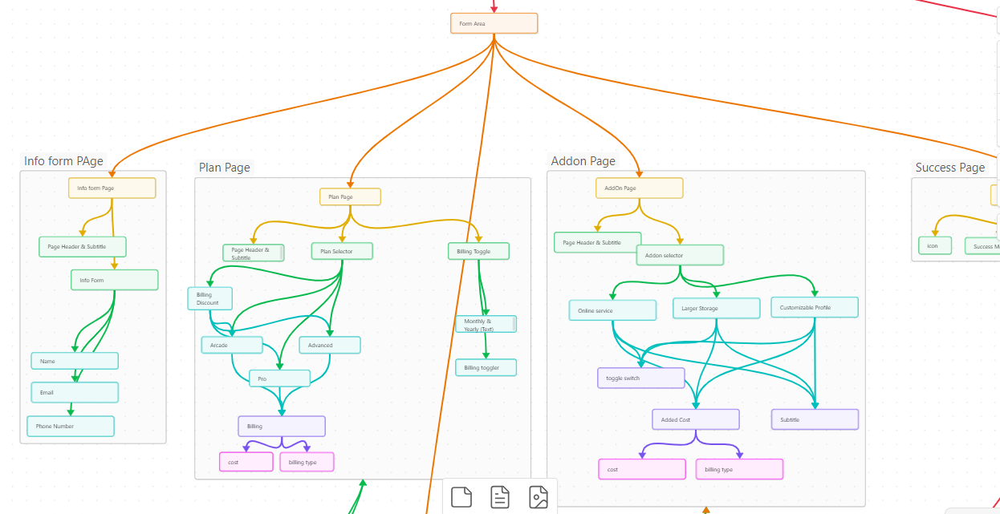

# Frontend Mentor - Subscription form solution

This is a solution to the [Multi-step form challenge on Frontend Mentor](https://www.frontendmentor.io/challenges/multistep-form-YVAnSdqQBJ).

## Table of contents

- [Overview](#overview)
- [The challenge](#the-challenge)
- [Screenshot](#screenshot)
- [Links](#links)
- [Built with](#built-with)
- [My Process](#my-process)
- [Continued development](#continued-development)
- [Developer](#developer)

## Overview

### The challenge

Users should be able to:

- Complete each step of the sequence
- Go back to a previous step to update their selections
- See a summary of their selections on the final step and confirm their order
- View the optimal layout for the interface depending on their device's screen size
- See hover and focus states for all interactive elements on the page
- Receive form validation messages if:
  - A field has been missed
  - The email address is not formatted correctly
  - A step is submitted, but no selection has been made

### Screenshot

### Links

  

### Built with

- Semantic HTML5 markup
- CSS
- TailwindCSS
- Flexbox
- Context API
- REST API
- Mobile-first workflow
- Framer Motion
- React hook forms
- [React](https://reactjs.org/) - JS library

### My Process

I went into this challenge looking for a...well, challenge (this is my first 'advanced' challenge since I started on Frontend Mentor :D) - and to get my hands a little dirty with tailwind css. I wanted to be more methodical/intentional with this project as well, have a clear plan and map out my process before starting out. So i drew up a development document that included a [map of the app](#screenshot) (the various pages and how they would interact with one another), the shape of the Context API that would store the state of the user's selections between pages and REST API to fetch subscription plans and addon information from a database (appwrite's free tier has been great for this).

Armed with my plan, I was able to create a proper file structure with more ease than in my previous projects. I opted to 2 sets of files for mobile and desktop users to make styling easier. This approach worked fine since both sets were hooked up to the same context and could share information at any point in the users progress through the app.

Using tailwindcss for styling was a wonderful experience and added speed and flexibility to my development process. As an added challenge I strove for pixel perfect accuracy in replicating the design images provided with the challenge. I didn't have access to the raw design files for the project so I had to get a bit resourceful measuring the PNGs down to the pixel and I think I got most of the dimesions right. Tailwind played a major role in making the process a lot less laborious that it would've been. I'd say I've gotten a good hang of it and will be using it a lot more in future projects.

Otherwise, my goal was to write clean, maintainable code (and to add comments where i thought them appropriate), and I think I succeeded.

### Continued development

I'm off to learn typecript more intentionally (I've been experimenting with nextjs projects written in typescript outside my FEMentor challenge run) but I think it's time to do a proper deep dive to see what all the fuss is about.

## Developer

 
